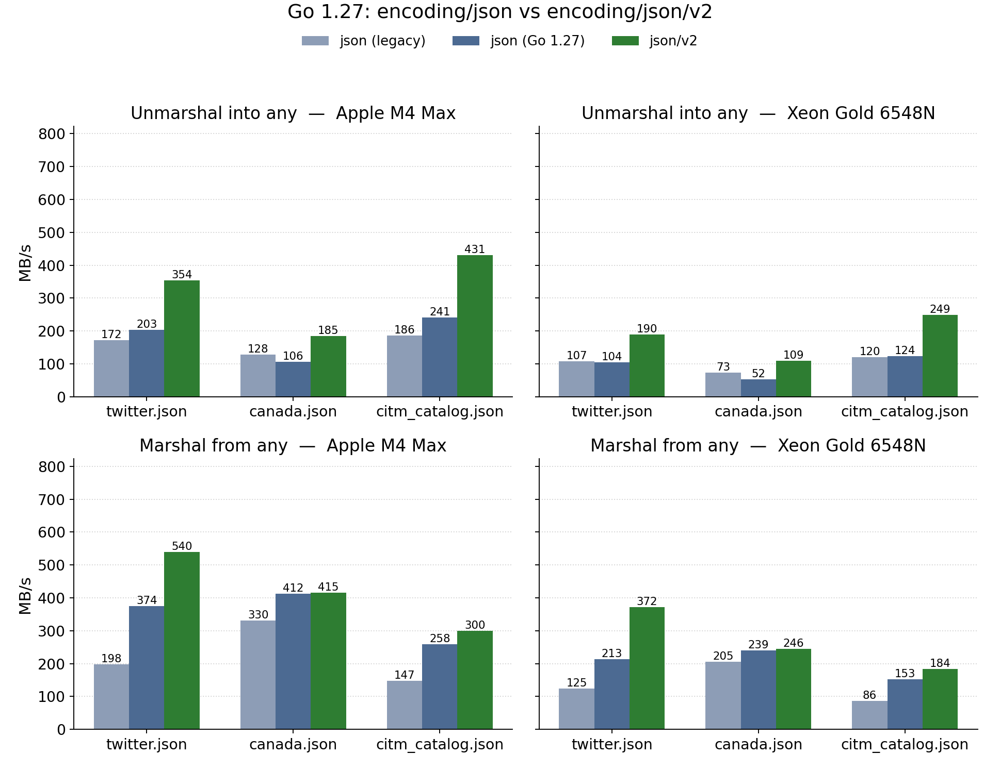
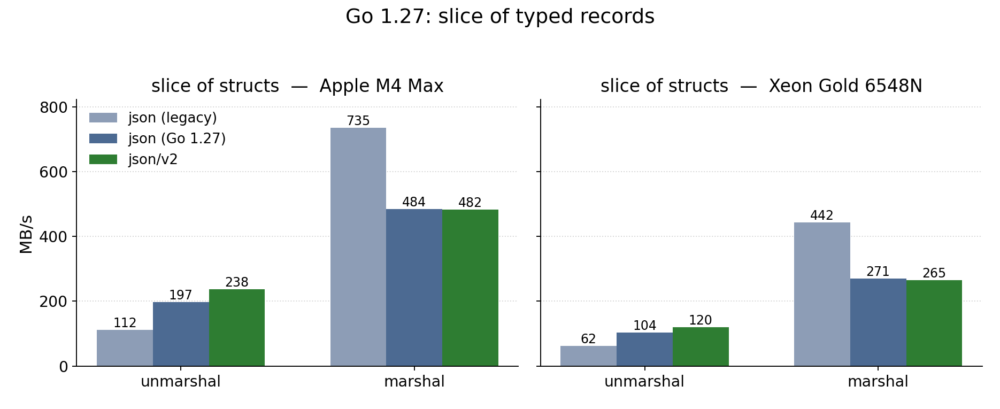

# The new Go JSON API: twice as fast, or 1.5x slower?

JSON is a standard format for data interchange. It is effectively a tiny subset of JavaScript made of objects and arrays. It looks as follows `{"key":1, "text":[1.0,2.0]}`.

Many programming languages include a JSON library in their standard libraries: C#, Go, Java (soon), Python, JavaScript, etc. The Go implementation is convenient, but not especially fast.

Go 1.27 makes a new JSON package (`encoding/json/v2`) available by default in its standard library. The two APIs look almost the same:

```go
import (
    json    "encoding/json"
    jsonv2  "encoding/json/v2"
)

b, err := json.Marshal(v)
b, err  = jsonv2.Marshal(v)

err = json.Unmarshal(b, &v)
err = jsonv2.Unmarshal(b, &v)
```

The two are not directly comparable as they differ with respect to Unicode validation, case sensitivity, etc. So it is not a drop-in replacement.


However, the legacy API (`encoding/json`) has also been reimplemented on top of the new engine. You can use the legacy API with either the new engine or the old one (`GOEXPERIMENT=nojsonv2`) through a flag. So we have three possibilities.

1. *json (legacy)* — `encoding/json` built with `GOEXPERIMENT=nojsonv2`, the original implementation
2. *json (Go 1.27)* — `encoding/json` as of 1.27, v1 API on the v2 backend
3. *json/v2* — `encoding/json/v2`

I used the usual [simdjson documents](https://simdjson.org/): `twitter.json` (632 kB, nested objects with short string keys), `canada.json` (2.25 MB, one large array of coordinates), and `citm_catalog.json` (1.73 MB, nested objects with numeric keys). I parse them into `any` (`interface{}`), which is the general-purpose path.

I ran this on an Apple M4 Max and on an Intel Xeon Gold 6548N (Emerald Rapids) using Go 1.27.0, on a single core (`GOMAXPROCS=1`), reporting the median of eight runs.



When unmarshalling, the legacy API on the new backend is faster than the original on `twitter.json` (172 MB/s to 203 MB/s) and on `citm_catalog.json` (186 MB/s to 241 MB/s), but slower on `canada.json` (128 MB/s down to 106 MB/s). When marshalling, it is up to twice as fast: 198 MB/s to 374 MB/s on `twitter.json`. So merely upgrading to Go 1.27, without changing a line of code, should make marshalling faster.

Switching to the new API helps more. Compared to the original implementation, `encoding/json/v2` unmarshals 1.5x to 2.3x faster and marshals 1.2x to 3x faster. Compared to the Go 1.27 legacy API, unmarshalling gains another 1.8x to 2x, while marshalling gains much less (1.0x to 1.7x): part of the remaining difference is that `json/v2` does less work during marshalling.


Thus far, I was unmarshalling into `any`, meaning that I assumed that I did not know the structure of the document. I also round-trip a slice of 10,000 small structs:

```go
type Record struct {
    ID     int      `json:"id"`
    Name   string   `json:"name"`
    Email  string   `json:"email"`
    Active bool     `json:"active"`
    Score  float64  `json:"score"`
    Tags   []string `json:"tags"`
}
```
The schema is specified: the JSON must be `[{"id":..., "name":...}, {"id":..., "name":...}...]`. I still get faster unmarshalling with the new API, but the legacy API with the legacy engine is faster when marshalling.



The original implementation is faster. The Go 1.27 release notes said that marshal performance is broadly at parity with the previous implementation. For my test, it is not the case.

So unmarshalling gets faster across the board with `encoding/json/v2`, and marshalling gets faster for `any`, but it is about 1.5x slower for typed structs in my tests. 

[The code is available.](https://github.com/lemire/Code-used-on-Daniel-Lemire-s-blog/tree/master/2026/08/29)
